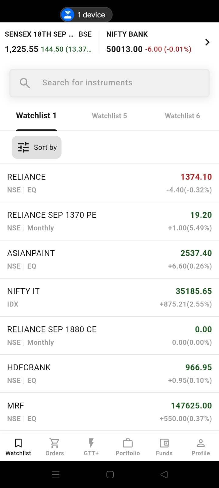
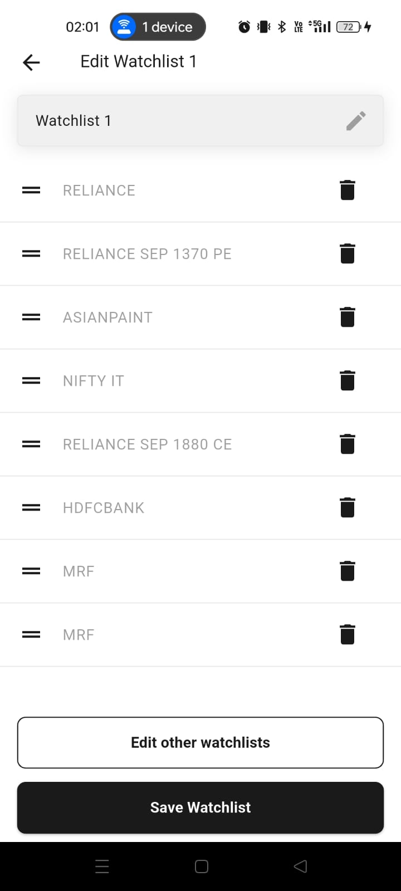

# TradeApp

A simple Flutter app I built to manage stock watchlists and see live market summaries.  
It’s modular, responsive, and uses BLoC for state management.

---

## Features

- **Watchlist:** Add, reorder, and delete stocks.
- **Edit Watchlist:** Drag and drop to reorder, changes are saved instantly.
- **Live Market Summary:** NIFTY Bank and SENSEX values update in real time (mocked for demo, can connect to a real API).
- **Responsive UI:** All sizes and styles are centralized for easy scaling.
- **Clean Code:** Modular widgets, centralized styling, and business logic separated.

---

## How I Built It

- Used `flutter_bloc` for state management.
- All UI values (paddings, font sizes, etc.) are in `lib/utils/responsive.dart`.
- Colors and text styles are in `lib/utils/app_colors.dart` and `lib/utils/app_text_styles.dart`.
- Watchlist order is managed in BLoC and stays the same even if you leave the screen.
- Market summary updates every second (easy to swap for real data).

---

## Project Structure

```
lib/
  bloc/
  data/
  screens/
    widgets/
  utils/
```

---

## Getting Started

1. Clone the repo:
   ```bash
   git clone https://github.com/kasim121/TradeApp.git
   cd TradeApp
   ```
2. Install dependencies:
   ```bash
   flutter pub get
   ```
3. Run the app:
   ```bash
   flutter run
   ```

---

## Notes

- All code is written by me, following best practices.
- UI is fully responsive and modular.
- Real-time updates are mocked for demo; can be connected to a real data source.

---

## Screenshots

  
**Watchlist Screen**

  
**Edit Watchlist Screen**

---